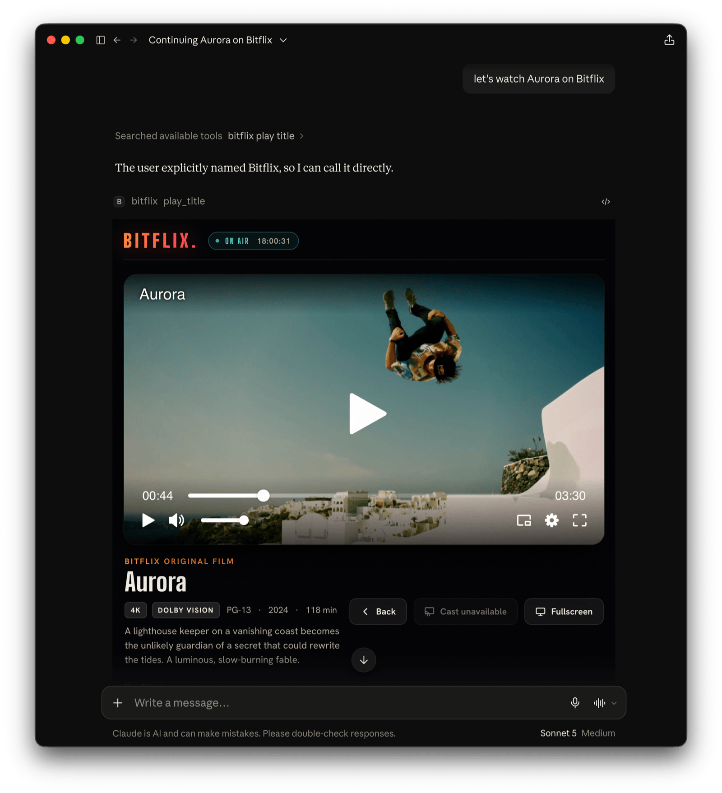

# Bitflix: a streaming service that lives inside the chat

Bitflix is a fictional streaming network (sports · news · films · originals) shipped as an
[MCP App](https://modelcontextprotocol.io).

You open it, browse it, get recommendations, and watch, all by talking to ChatGPT or Claude. It's a reference
implementation, and a working answer to:

> _What does an online video platform need to be when the "app" is a conversation and the UI is generated on the fly?_

Bitflix is built on the [Skybridge](https://github.com/alpic-ai/skybridge) React framework for MCP Apps,
so you can run it in the local playground, expose it through a dev tunnel, or deploy it to a permanent URL.
The [Bitmovin Player](https://bitmovin.com/video-player/) handles video playback directly in the chat widget.



## What's in the box

```
src/
├── catalog.ts          # content: titles, public test streams, sections, search/recommend
├── server.ts           # McpServer + 5 tools (registerTool), view CSP, license-key injection
├── env.ts              # typed env (BITMOVIN_PLAYER_KEY)
├── helpers.ts          # generateHelpers<AppType>() → typed useToolInfo / useCallTool
├── index.css           # the broadcast OTT design system
└── views/
    ├── browse.tsx · recommend.tsx · live.tsx · player.tsx · diagnostics.tsx  # one entry per tool
    ├── hooks.ts            # view hooks
    └── components/
        ├── BitflixApp.tsx          # shared widget: browse + player + cast + chips
        ├── BitmovinPlayer.tsx      # Bitmovin Player in a React component
        ├── BitmovinPlayerLazy.tsx  # code-split wrapper around the player
        ├── Diagnostics.tsx         # video-capability probe for the host sandbox (DRM, fullscreen, cast…)
        ├── Icon.tsx                # inline SVG icon component
        └── cover.ts                # inline SVG cover art, one of nine hand-drawn scenes
```

### Tools

Each tool the server offers binds to a view via `registerTool({ view: { component } })`.

| Tool                  | View          | Example utterance                    |
| --------------------- | ------------- | ------------------------------------ |
| `browse_catalog`      | `browse`      | "open Bitflix", "show me sports"     |
| `get_recommendations` | `recommend`   | "what should I watch tonight?"       |
| `whats_live`          | `live`        | "any games on?", "what's live?"      |
| `play_title`          | `player`      | "play the finals", "resume Aurora"   |
| `run_diagnostics`     | `diagnostics` | "test what video features work here" |

The first four tools render the shared `BitflixApp`, which switches between the browse face and the player
face via `payload.view`. Clicking a tile starts playback, the category chips call back to the server with
`useCallTool`, and `data-llm` keeps the model in sync with what's on screen.

The `run_diagnostics` tool renders the `Diagnostics` view, a live probe of what the current MCP host's widget
sandbox supports for video. It covers MSE, EME/DRM key systems (Widevine, PlayReady, FairPlay, ClearKey), Web
Workers, WebAssembly, fullscreen (host display-mode request and native Fullscreen API), Picture-in-Picture,
casting/Presentation, and autoplay.

### Content / Streams

All streams are **public test assets**, so the demo works out of the box:

- **VoD** plays HLS and DASH "Art of Motion" test content hosted on `cdn.bitmovin.com`
- **Live** plays [DASH-IF livesim2](https://livesim2.dashif.org), a real live DASH stream that is fully public
  (CORS `*`, self-hosted segments)
- Cover art is inline SVG, composed from one of nine hand-drawn scenes (court, pitch, globe, film, summit, orbit…)

**Content Security Policy:**

The app's widget runs in a sandboxed iframe and can only reach origins the server declares up front. So `VIEW_CSP`
in `src/server.ts` allow-lists the origins hosting the content and any other network-loaded resources.
See [CSP & CORS](https://apps.extensions.modelcontextprotocol.io/api/documents/csp-and-cors.html) in the MCP Apps docs.

## Bitmovin Player license key

The `bitmovin-player` dependency is a proprietary, commercially-licensed SDK. See the [Licensing](#licensing) section.
Visit the [Bitmovin dashboard](https://dashboard.bitmovin.com/player/licenses) to start a trial subscription or retrieve
a license key for your active subscription.

## Run it

Requires Node 22.12+ (24+ is recommended).

```bash
npm ci
cp .env.example .env        # create .env file and add your own BITMOVIN_PLAYER_KEY
npm run dev                 # then open the DevTools playground at http://localhost:3000
```

- `npm run dev`: local DevTools playground at port `3000` (run each tool, audit CSP, etc.)
- `npm run dev:tunnel`: same, exposed over a stable tunnel you can add to Claude/ChatGPT
- `npm run build` / `npm start`: production build / serve
- `npm run deploy`: deploy to [Alpic](https://alpic.ai/) for a permanent HTTPS URL

**Player domain allow-listing:**

A Bitmovin Player license only works on the domains you register for it in the
[Bitmovin dashboard](https://dashboard.bitmovin.com/player/licenses).

- Allow-list the MCP host's sandbox domain, i.e.
  `*.claudemcpcontent.com` for Claude and `*.oaiusercontent.com` for ChatGPT.

- When testing on the DevTools playground in a web browser on a non-localhost domain (tunnel or a deployed URL), also
  allow-list that domain.

### Connect to your MCP host (e.g. Claude or ChatGPT)

1. Run `npm run dev:tunnel` to get a public URL to your MCP server, e.g. `https://foo-bar-42.alpic.dev/mcp`
2. Add this URL as a custom MCP/connector in your Claude/ChatGPT app
3. Open a new chat and write _"open Bitflix"_, _"what's live?"_, _"recommend something short"_

### Troubleshooting

If the MCP app does not render:

- Use the Claude or ChatGPT app. Not every MCP host renders MCP Apps views; some may show only the tool call and
  its text result.
- Update the Claude/ChatGPT app. MCP Apps support is new, and older versions may not render views.
- Open the MCP URL (e.g. `https://foo-bar-42.alpic.dev/mcp`) in a web browser. A running server answers with a
  small JSON error (`Method not allowed`).
- If run with `npm run dev`, open the MCP URL without the `/mcp` path to reach the DevTools playground and run the
  tool there. If the view renders, the server is fine and the problem is on the host app side.
- Remove and re-add the MCP connector in your host app.

## Known Issues & Limitations

The MCP host (e.g. Claude, ChatGPT) controls the widget sandbox's capabilities. The
[MCP Apps specification](https://apps.extensions.modelcontextprotocol.io) is still under active development, so those
capabilities currently vary between hosts and shift as the specification and the host implementations evolve.
Depending on which host is used, the following features may behave differently or not work at all:

- Fullscreen
- Autoplay with sound
- Playback of DRM-protected content
- Remote Playback (Google Cast and Apple AirPlay)
- Picture-in-Picture
- Client-side advertising

Run the `run_diagnostics` tool in your host to see what it permits.

## Making it real (what a production OVP would change)

1. Back `catalog.ts` with a real CMS/MAM + entitlements.
2. Replace `recommendationsPayload` with a real personalization service.
3. Real DRM (Widevine/FairPlay/PlayReady) + per-session tokens via the player `sourceConfig`.
4. Bitmovin Analytics in the player config for QoE/engagement.

## Licensing

The source code in this repository is released under the [MIT License](./LICENSE).

The Bitmovin Player SDK (`bitmovin-player` NPM dependency) is proprietary and commercially licensed by Bitmovin.
To run this app you must get your **own** Bitmovin Player license key from the
[Bitmovin dashboard](https://dashboard.bitmovin.com/player/licenses) and comply with the
[Bitmovin Player license terms](https://bitmovin.com/player-license/).

The streams in the catalog are third-party public test assets, used for demonstration only.

---

_Bitflix, its teams, scores, and titles are fictional._
